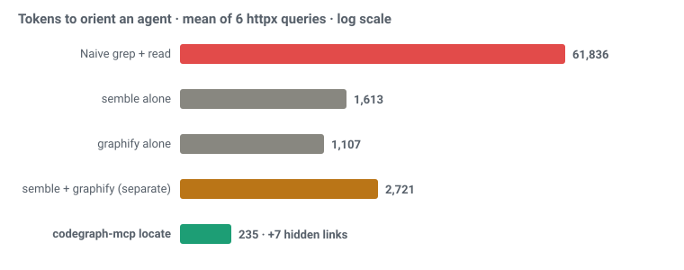
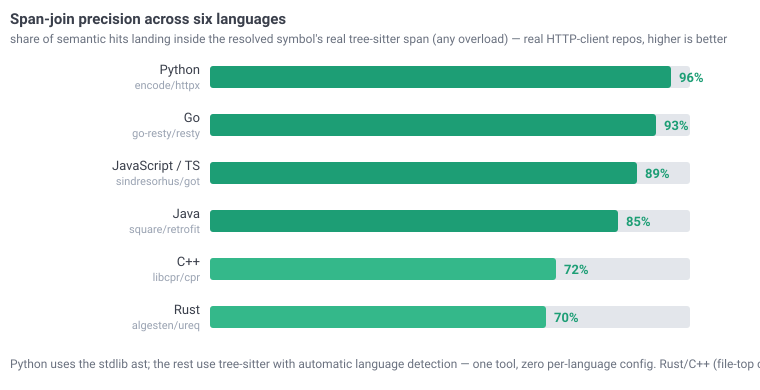

# graphlore

[](https://github.com/yasinyaman/graphlore/actions/workflows/ci.yml)
[](LICENSE)
[](https://www.python.org/)

A Python MCP server that turns a codebase into a queryable knowledge graph for AI
coding agents. It exposes the [Graphify](https://graphify.net) graph as 28 MCP
tools, prompts and resources — so an assistant explores your code structurally
and cheaply (token-budgeted maps, not walls of source) instead of grepping and
reading file after file.

> Note: Graphify ships its own embedded MCP server (`graphify ./raw --mcp`). This
> project adds the analysis layer on top: semantic locate with `hidden_links`,
> token-budgeted subgraph extraction, git-aware freshness, impact/cycles/route/API
> analyses, per-community resources, reusable prompts, and LLM-friendly tool
> annotations + structured (JSON) output.

### Why `graphlore_locate`

One MCP call turns a natural-language question into a **navigational map**, not a wall of code:

- 🔎 **Semantic + structural, one call** — semble finds the relevant code, the graph gives its neighborhood. ~235 tokens to orient vs ~61k for grep+read (**263× fewer** on httpx).
- 🔗 **`hidden_links`** — semantically similar code that is *structurally disconnected* (duplication / missing-abstraction / sync-async-twin candidates) that neither search nor the graph surfaces alone.
- 🌍 **Multi-language, zero config** — Python via stdlib `ast`; JS/TS · Go · Java · Rust · C++ · 165+ more via tree-sitter with automatic language detection. **Span-join precision 70–96%** on real HTTP-client repos in six languages, at **1 tool call / 0 file reads** per orientation ([benchmark](#benchmark)).
- 🕒 **Cosmetic-aware freshness** — `graphlore_freshness` ignores comment/format-only edits (in every language) so a reformat never triggers a needless rebuild.

### One call beats running semble and graphify separately

semble finds **what's relevant**; graphify gives **how it connects**. They're complementary — but stitching them by hand means four calls, ~2.7k tokens, and manually aligning semble's line ranges to graph nodes. graphlore does that join *for* you, in one call:

| _per query_ | semble alone | graphify alone | both, by hand | **`graphlore_locate`** |
|---|:-:|:-:|:-:|:-:|
| Semantic search | ✓ | — | ✓ | ✓ |
| Graph structure | — | ✓ | ✓ | ✓ |
| Chunk → symbol join | — | — | _you wire it_ | **✓ automatic** |
| `hidden_links` cross-check | — | — | — | **✓ only here** |
| Calls | 1 | 1 | **4** | **1** |
| Tokens to orient | 1,613 | 1,107 | 2,721 | **235** |

→ **11.6× fewer tokens than running the two separately — in a single call**, and `hidden_links` (semantically similar code that is *structurally disconnected*) is a signal *neither tool produces alone*. So the combined tool isn't just convenience: it's cheaper, and it surfaces something the parts can't. ([full benchmark ↓](#benchmark))

## Installation

```bash
# graphlore itself
pip install graphlore

# plus the Graphify CLI it wraps (needed for build/query/path/explain/add)
pip install graphifyy && graphify install
```

From source:

```bash
git clone https://github.com/yasinyaman/graphlore
cd graphlore
pip install -e ".[dev]"
```

Optional extras: `[semble]` (semantic locate + duplication scan), `[treesitter]`
(non-Python span/API/route engines; usually already present via graphify),
`[tiktoken]` (exact token counts), `[watch]` (filesystem watcher).

## Running

```bash
GRAPHLORE_PROJECT_DIR=/path/to/repo graphlore
# equivalently:
GRAPHLORE_PROJECT_DIR=/path/to/repo python -m graphlore
```

> **Renamed from `graphify-mcp`:** the old name collided with the
> `graphify-mcp` console script that `graphifyy` ships for its embedded
> server, which forced the clunky `graphify-mcp-server` entry point. As
> `graphlore` the bare command is ours. The boot banner on stderr
> (`graphlore vX.Y.Z | transport=… | project=…`) confirms which server
> and project dir you're actually running.

### Claude Code

Copy `mcp.json` to a `.mcp.json` at your project root. `GRAPHLORE_PROJECT_DIR: "."` uses the project root.

### Claude Desktop / Cowork

Add the contents of `claude_desktop_config.json` to your Claude Desktop config:
- macOS: `~/Library/Application Support/Claude/claude_desktop_config.json`
- Windows: `%APPDATA%\Claude\claude_desktop_config.json`

### Transport (stdio default, optional HTTP)

stdio is the default and the right choice for a per-developer local server. To
serve over HTTP instead (e.g. a shared graph for a team or a web MCP client):

```bash
GRAPHLORE_TRANSPORT=streamable-http GRAPHLORE_HOST=127.0.0.1 GRAPHLORE_PORT=8000 \
  GRAPHLORE_PROJECT_DIR=/path/to/repo graphlore
```

Any HTTP transport **force-enables path containment** (`GRAPHLORE_RESTRICT_PATHS`)
so a network client can't drive `graphlore_build` to extract arbitrary filesystem
paths. HTTP binds `127.0.0.1` by default. To expose it beyond localhost, set
`GRAPHLORE_API_KEY` — every request must then send `Authorization: Bearer <key>`
(constant-time checked, 401 otherwise); binding a non-loopback host without a key
prints a warning.

When bound to a loopback host, the MCP SDK auto-enables **DNS-rebinding
protection**: only `Host: 127.0.0.1 / localhost / ::1` requests are accepted. A
reverse proxy in front (nginx/caddy on a public name forwarding to
`127.0.0.1`) must therefore rewrite the `Host` header — or set
`GRAPHLORE_ALLOWED_HOSTS` to the public name(s) (comma-separated, `:*` port
wildcards allowed; `*` disables the protection for a trusted proxy).

The CLI is always invoked as an argument list with **no shell** (`subprocess.run`
with `shell=False`), so a build `path` or query string can't inject shell commands.
Per-file analyzers (spans/APIs/routes/fetch) are confined to the project
directory through a single path-resolution boundary, so a hostile path in a
graph or chunk can't read files outside the project. For a shared/network
deployment, also consider lowering `GRAPHLORE_TIMEOUT` (default `600`s) so a
single slow `graphlore_build` can't tie up a worker for ten minutes.

```bash
GRAPHLORE_TRANSPORT=streamable-http GRAPHLORE_HOST=0.0.0.0 GRAPHLORE_API_KEY=$(openssl rand -hex 16) \
  GRAPHLORE_PROJECT_DIR=/path/to/repo graphlore
```

For a smaller tool surface (helps some models pick the right tool), set
`GRAPHLORE_TOOLSET=lean` to expose only the core exploration tools — or
`GRAPHLORE_TOOLSET=locate` for the minimal locate-first surface: orient with one
`graphlore_locate` call, hydrate code with `graphlore_fetch`, stay in sync with
`graphlore_build`/`graphlore_freshness`. `locate` needs a semantic backend (the
`[semble]` extra or `GRAPHLORE_SEMANTIC_BACKEND`) and falls back to `lean` without
one.

## Tools

CLI-backed (the first two write state; the rest are read-only):

| Tool | Purpose |
|---|---|
| `graphlore_build` | Build/update the graph (`update`, `cluster_only`, `code_only`, `mode="deep"`) |
| `graphlore_add` | Add a source by URL (arXiv, tweet) |
| `graphlore_query` | Natural-language query (`dfs`, `budget`) |
| `graphlore_path` | Exact path between two nodes |
| `graphlore_explain` | Everything about a node |

graph.json analysis (read-only, no CLI needed, `as_json=True` for structured output):

| Tool | Purpose |
|---|---|
| `graphlore_overview` | **Call first** — size, god nodes, communities, surprises, suggested next steps |
| `graphlore_god_nodes` | Most connected nodes |
| `graphlore_communities` | Leiden community summaries |
| `graphlore_surprises` | Unexpected cross-domain connections |
| `graphlore_search` | Node search |
| `graphlore_neighbors` | 1-hop neighbors of a node |
| `graphlore_subgraph` | **Token-budgeted** BFS subgraph around a node — the cheap way to feed the model just the relevant slice |
| `graphlore_impact` | Reverse-dependency / **blast radius** — what breaks if a node changes (`direction=dependents`/`dependencies`/`both`), ordered by hop distance |
| `graphlore_node_details` | Node metadata: type, source file/line, docstring, community |
| `graphlore_skeleton` | def/class **signatures** (decorators kept, bodies stripped) for a file/node/community — the middle layer between the map and full code |
| `graphlore_fetch` | **Token-budgeted** source hydration — reads the real code for a node (its enclosing def/class span ± context), the map→code other half of `subgraph`/`locate` |
| `graphlore_freshness` | Is the graph stale vs. git HEAD? Returns `recommended_action` (fresh/update/rebuild) + `reason` — lingering phantom nodes / large changes steer to a rebuild; junk files (`.DS_Store`, logs) land in `non_source_changes` and never hold the graph stale |
| `graphlore_diff` | Structural changeset between two git refs (default `HEAD~1..HEAD`) — added/removed/renamed/modified, with cosmetic-only changes separated (file-level, for review/audit) |
| `graphlore_prune` | Drop phantom nodes (and their edges) for deleted/renamed source files — the surgical alternative to a full rebuild (`dry_run=True` to preview) |
| `graphlore_validate` | Lint the graph for dangling/duplicate/self-loop edges and orphan nodes (read-only) |
| `graphlore_duplication_scan` | **Repo-wide** hidden-link / duplication audit — the batch form of `locate`'s `hidden_links` (similar-but-structurally-far pairs); needs `[semble]`, outside lean |
| `graphlore_cycles` | Circular dependencies — strongly-connected node groups in the directed graph (an architectural smell), self-loops listed separately |
| `graphlore_package_apis` | **Symbol-level external API surface** — which names each external package is actually used for (`fastapi: Depends, APIRouter`), with qualified paths (`numpy.linalg.norm`) for version-diff audits; a lower bound (dynamic/star/getattr use is invisible). Python via stdlib ast; JS/TS, Go, Java need `[treesitter]` |
| `graphlore_routes` | **Framework route → handler table** — which URL patterns hit which code, joined back to graph nodes (`GET /items/{id} -> read_item (app.py:5)`). FastAPI/Flask/Sanic/Quart/Litestar/Django, Express/NestJS (import-gated, so `axios.get('/x')` never registers), gin/chi/net-http (incl. Go 1.22 `"GET /x"` patterns, gin 3-arg `Handle`, chi nesting), Spring (method arrays split per verb); a lower bound (dynamic/chained registration is invisible). Python via stdlib ast; the rest need `[treesitter]` |

Semantic naming (uses the **host model via MCP sampling** — no API key — or a backend key):

| Tool | Purpose |
|---|---|
| `graphlore_sampling_status` | Capability test: reports whether the client supports host-LLM sampling, whether a backend key is set, and which method will be used |
| `graphlore_label_communities` | Give Leiden communities human-readable names. `method="auto"` (sampling → key → placeholder), `"sampling"`, `"cli"`, or `"placeholder"` |
| `graphlore_set_labels` | Persist **assistant-provided** community names (sampling-free fallback) to `.graphify_labels.json` and patch them into `graph.html` |

Semantic bridge (optional `[semble]` extra — semantic search joined to graph structure):

| Tool | Purpose |
|---|---|
| `graphlore_locate` | NL query → enclosing graph node → token-budgeted subgraph, **plus `hidden_links`**: semantically-similar code that is structurally disconnected (duplication / missing-abstraction candidates) |

## Typical workflow

1. `graphlore_locate("where do we retry failed requests?")` — one-call orientation
   (or `graphlore_overview()` → `graphlore_subgraph("SomeNode")` without the semble extra)
2. `graphlore_fetch(["Client._send_single_request"])` — hydrate exactly the code you zeroed in on
3. `graphlore_impact("Response")` / `graphlore_cycles()` / `graphlore_routes()` — targeted analysis
4. `graphlore_query("how does the auth flow work?")` — free-form questions via the CLI
5. After code changes: `graphlore_freshness()` → `graphlore_build(update=True)`
   (plus `graphlore_prune()` after deletes/renames)

## Keeping the graph fresh

The analysis tools surface staleness for you: `graphlore_overview` and
`graphlore_subgraph` carry a lightweight `graph_age` ("built 3 commits ago"), and
`graphlore_freshness` gives a full `recommended_action` (fresh / update / rebuild).
To stop thinking about it, regenerate on every commit with a git **post-commit
hook** — the recommended first-class auto-update flow:

```sh
# .git/hooks/post-commit   (then: chmod +x .git/hooks/post-commit)
#!/bin/sh
# incremental, viz-free, backgrounded so the commit returns immediately
graphify . --update --no-viz >/dev/null 2>&1 &
```

Incremental `--update` only re-extracts changed files — it can't *drop* nodes for
deleted/renamed code on its own. `graphlore_prune` closes that gap: it surgically
removes the phantom nodes (and their edges) for source files that are gone from the
working tree, so after a delete/rename you can `graphlore_prune` (preview with
`dry_run=True`) + `graphlore_build(update=True)` instead of a full rebuild.
`graphlore_freshness` knows about this — it only steers to a rebuild while phantom
nodes for the removed files still linger, and reports them in `phantom_files`. An
agent can also just call `graphlore_build(update=True)` when `graph_age` /
`graphlore_freshness` says the graph drifted.

There's also an opt-in filesystem watcher (`GRAPHLORE_WATCH=1`, the `[watch]`
extra): it re-syncs the graph on structural source changes, ignores cosmetic
edits and non-source churn (VCS internals, virtualenvs, its own output), and
debounces via `GRAPHLORE_WATCH_DEBOUNCE`.

## Semantic bridge (optional `[semble]`)

`pip install "graphlore[semble]"` adds `graphlore_locate`, which joins
[semble](https://github.com/MinishLab/semble)'s semantic code search to the graph
in one call. Graphify gives **structure** (how code connects); semble gives
**retrieval** (which code is semantically relevant) — they're complementary.

`graphlore_locate("how does retry backoff work")`:
1. semble finds the most relevant code and resolves the top hit to its enclosing
   graph node (better than label matching).
2. returns the token-budgeted subgraph around it (**structure**).
3. runs semble `find_related` and cross-checks: a cousin that is semantically
   similar but **not** within the seed's structural neighborhood is flagged as a
   `hidden_link` (with its hop distance) — a duplication / missing-abstraction /
   implicit-coupling candidate that neither tool surfaces alone.

The extra is optional: without it the core tools are unchanged and `graphlore_locate`
returns an install hint. Any other embedding backend can be plugged in via
`GRAPHLORE_SEMANTIC_BACKEND=module.path:Factory` (implementing `search` /
`find_related`). It also pairs well with running semble's own MCP server
alongside graphlore.

The chunk→node join and the freshness cosmetic-vs-structural check work
**across languages**: Python uses the stdlib `ast` (no extra deps), and every
other language (JS/TS, Go, Rust, Java, Ruby, C/C++, …) is handled by an optional
**tree-sitter** backend — `pip install "graphlore[treesitter]"`, also pulled in
by graphify. Without it, non-Python files fall back to nearest-line matching.

## Naming communities without an API key (MCP sampling)

The Leiden clustering is keyless, but turning `Community 7` into `Authentication`
needs a model. Three ways, in `graphlore_label_communities`'s preference order:

1. **Host-LLM sampling** — the server asks the *connected client* to run the
   completion via MCP `sampling/createMessage`. The model the user already uses
   (e.g. Claude in a sampling-capable client) does the naming; **the server holds
   no API key**. Subject to client support — call `graphlore_sampling_status`
   first; it degrades gracefully when unsupported. All communities are named in
   a single batched request, carried over whichever transport the negotiated
   protocol allows (the legacy back-channel, or input-required rounds on MCP
   2026-07-28+), so it works with both older and modern clients.
2. **Backend API key** (`method="cli"`) — set `GEMINI_API_KEY` / `OPENAI_API_KEY`
   / `ANTHROPIC_API_KEY` / … (or run a local **ollama**) and graphify's own
   backend names them. This option always remains available.
3. **Placeholders** — no model anywhere: names stay `Community N`.

If the client can't sample and you have no backend (e.g. **Claude Code**, which
doesn't support sampling), use the **assistant-driven fallback**: the assistant
is already a capable model in the loop, so it reads `graphlore_communities` and
pushes names back via **`graphlore_set_labels({"0": "Authentication", ...})`** —
no key, no sampling, works in any client. The names persist to
`.graphify_labels.json` and are patched into `graph.html`.

## Benchmark

Averaged over **6 queries** spanning httpx subsystems (send path, digest auth,
redirects, content decoding, cookies, timeouts) on the 2,101-node graph. Each query
orients an agent to a code area; *tokens* = what reaches the model's context
(≈ chars/4).



| Approach | Tokens (avg) | Calls | Structure | Semantic | Hidden links |
|---|---|---|---|---|---|
| Naive grep + read | 61,836 | ~14 | — | — | 0 |
| semble alone | 1,613 | 1 | — | ✓ | 0 |
| graphify alone | 1,107 | 1 | ✓ | — | 0 |
| semble + graphify (separately) | 2,721 | 4 | ✓ | ✓ | 0 |
| **`graphlore_locate`** | **235** | **1** | ✓ | ✓ | **7** |

`graphlore_locate` averages **263× fewer tokens than grep+read** and **11.6× fewer
than running semble and graphify separately** (one call instead of four) — and it's
the only approach that surfaces `hidden_links` (semantically similar but structurally
disconnected code), 5–10 per query.

Those ~235 tokens are a navigational *map* (seed `file:line` + structural
neighborhood + hidden links), not raw code — you fetch the specific code only where
needed. That's the trade graphlore optimizes: cheapest orientation plus the
cross-check signal, then drill in precisely.

**Case study — the hidden links are real.** Asked *"does httpx duplicate
request-sending across sync and async?"*, `graphlore_locate` returned the seed
`Client._send_single_request` and flagged hidden links. Checking the source
confirmed every production flag is a genuine sync/async twin:
`Client._send_single_request` (`_client.py:1001`) ↔ `AsyncClient._send_single_request`
(`:1717`); `BaseTransport.handle_request` ↔ `handle_async_request` (in every
transport); `__enter__` ↔ `__aenter__`. ~500 tokens (one `locate` + a targeted read)
surfaced a real architectural pattern that naively reading `_client.py` (~16k tokens)
would. The far-distance bucket also held test files (related, not refactor targets) —
the `distance` field separates production parallels (3–4) from that noise.

**Across languages — real HTTP-client repos.** The span join and freshness check aren't
Python-only. I built AST-only graphs for an HTTP client in five more languages and ran the
same kind of queries (send · redirects · timeout/retry · headers/auth · transport):



| Language | Repo | Span-join precision | Qualname | Hidden / q | locate vs grep | Calls (locate vs naive) |
|---|---|---|---|---|---|---|
| **Python** (ast) | `encode/httpx` | **96%** (52/54) | 67% | 3.2 | 272× | 1 vs 15 (0 vs 14 reads) |
| JavaScript / TS | `sindresorhus/got` | 89% (48/54) | 67% | 2.3 | 583× | 1 vs 9 (0 vs 8 reads) |
| Go | `go-resty/resty` | 93% (50/54) | 100% | 1.8 | 911× | 1 vs 17 (0 vs 16 reads) |
| Java | `square/retrofit` | 85% (46/54) | 50% | 2.3 | 217× | 1 vs 18 (0 vs 17 reads) |
| Rust | `algesten/ureq` | 70% (38/54) | 83% | 3.7 | 577× | 1 vs 22 (0 vs 21 reads) |
| C++ | `libcpr/cpr` | 72% (39/54) | 100% | 4.3 | 195× | 1 vs 16 (0 vs 15 reads) |

Python uses the stdlib `ast`; JS/TS · Go · Java · Rust · C++ go through tree-sitter with
automatic language detection — **one tool, zero per-language config**. *Span-join precision* =
share of semantic hits landing inside the resolved symbol's real span (any overload of it —
C++ collapses same-name overloads into one graph node while each keeps its own span; cpr's
`Session::SetOption` has 46). It's **70–96%** across six 350–2,095-node graphs, hidden-links
keep surfacing 2–4/query, and locate stays **195–911× cheaper** than grep+read. Orientation is
also **one tool call with zero file reads** by construction, where the grep-driven baseline
spends 9–22 calls opening 8–21 files per query — **89–95% fewer calls**, on the same grep
baseline as the token numbers. Rust and C++
trail at 70–72% — their misses are mostly file-top/whole-file chunks and namespace-level free
functions where the resolution is still correct (they recover qualified names at 83–100%).
`graphlore_freshness`'s cosmetic-vs-structural check is correct in every language too
(comment/reformat → cosmetic; operator/rename → structural). Re-measured 2026-08 on the MCP v2
SDK, Python 3.14, fresh repo HEADs. Reproduce with
[`benchmarks/multilang.py`](benchmarks/multilang.py) (`--json` persists a run;
[`benchmarks/results-multilang.json`](benchmarks/results-multilang.json) is the committed
record of the call/token baseline — its span-join counts predate the overload-family
re-count above).

→ **[Full benchmark report](https://htmlpreview.github.io/?https://github.com/yasinyaman/graphlore/blob/master/docs/benchmark.html)** (interactive HTML, per-query breakdown + the cross-language tables) — or open [`docs/benchmark.html`](docs/benchmark.html) locally. ([Türkçe](https://htmlpreview.github.io/?https://github.com/yasinyaman/graphlore/blob/master/docs/benchmark.tr.html))

<sub>httpx headline measured 2026-06 with semble 0.3.4 (6 queries, per-query locate 189–286
tokens); cross-language table re-measured 2026-08 with semble 0.5.5 + the tree-sitter span
backend — 6 queries × 54 hits each on `httpx` / `got` / `resty` / `retrofit` / `ureq` / `cpr`,
call counts from the same run. **Sample bias:** every repo benchmarked here is
an HTTP-client library — a deliberately uniform family chosen for cross-language comparability.
Token savings and span-join precision will differ on other architectures (data pipelines, GUI
apps, sprawling monorepos), so treat these as indicative, not guarantees. Numbers vary by
codebase and query.</sub>

## Resources

- `graphlore://report` — GRAPH_REPORT.md
- `graphlore://graph` — graph.json (raw)
- `graphlore://community/{id}` — per-community wiki (members + internal/boundary edges)

## Prompts

Reusable templates that orchestrate the tools for the assistant:

- `onboard` — orient to the codebase (overview → communities → subgraphs → surprises → summary)
- `trace_bug(symptom)` — find likely root-cause locations through the graph
- `explain_flow(flow)` — end-to-end walkthrough of a named flow with file:line refs

## LLM-friendliness

- **Tool annotations** (`read_only_hint`, `destructive_hint`, titles) tell the model which tools are safe to call freely vs. which mutate state.
- **Server instructions** describe the recommended flow (locate/overview → targeted subgraph/fetch → build update).
- **`as_json` output** on every analysis tool — including error and no-match paths — returns structured data the model can chain on instead of re-parsing prose.
- **Token budgeting** (`graphlore_subgraph`, `graphlore_fetch`, `graphlore_skeleton`) keeps context small on large graphs — the core of Graphify's ~71× compression.
- **Unambiguous names** — when several nodes share a bare label (five `.auth_flow()`s across auth classes), rendered output qualifies them with the span-recovered FQN (`DigestAuth.auth_flow()`) or a `file:line` suffix, so an arrow always names exactly one symbol.
- **Host-LLM sampling** (`graphlore_label_communities`) lets the server borrow the client's model via MCP `sampling/createMessage`, so semantic naming works with no server-side API key — with a capability test (`graphlore_sampling_status`) and a backend-key fallback.

## Environment variables

| Variable | Default | Description |
|---|---|---|
| `GRAPHLORE_PROJECT_DIR` | `.` | Project root to extract the graph from |
| `GRAPHLORE_OUT_DIR` | `graphify-out` | Output folder name |
| `GRAPHLORE_BIN` | `graphify` | CLI path |
| `GRAPHLORE_TIMEOUT` | `600` | CLI timeout (seconds) |
| `GRAPHLORE_RESTRICT_PATHS` | `0` | Confine `graphlore_build`'s `path` to the project dir (auto-on for HTTP) |
| `GRAPHLORE_TRANSPORT` | `stdio` | `stdio` \| `streamable-http` \| `sse` |
| `GRAPHLORE_HOST` | `127.0.0.1` | Bind host for HTTP transports |
| `GRAPHLORE_PORT` | `8000` | Bind port for HTTP transports |
| `GRAPHLORE_API_KEY` | _(unset)_ | Require `Authorization: Bearer <key>` on HTTP transports |
| `GRAPHLORE_ALLOWED_HOSTS` | _(unset)_ | DNS-rebinding `Host` allowlist for HTTP (comma-separated, `:*` port wildcards; `*` disables). Unset = SDK default: loopback-only when bound to loopback |
| `GRAPHLORE_TOOLSET` | `full` | `full` \| `lean` (core exploration tools only) \| `locate` (minimal locate-first surface; falls back to `lean` without a semantic backend) |
| `GRAPHLORE_TOKENIZER` | _(heuristic)_ | `tiktoken` → exact token counts (needs the `[tiktoken]` extra); else chars/3.5 estimate |
| `GRAPHLORE_SEMANTIC_BACKEND` | `semble` | Semantic index: `semble`, or `module.path:Factory` implementing `search`/`find_related` (validated at boot) |
| `GRAPHLORE_WATCH` | `0` | Filesystem watcher: auto re-sync on structural changes (`[watch]` extra) |
| `GRAPHLORE_WATCH_DEBOUNCE` | `2.0` | Watcher debounce window (seconds) |

> Every variable is also honored under its legacy `GRAPHIFY_*` spelling (the
> pre-rename names); when both are set, `GRAPHLORE_*` wins. Artifacts of the
> wrapped Graphify CLI keep their own names regardless (`graphify-out/`,
> `.graphify_labels.json`, the `graphify` binary).

## Project layout

```
graphlore/
├── src/graphlore/          # package
│   ├── server.py           #   MCP server: 28 tools, prompts, resources, transports
│   ├── graph.py            #   graph.json loading, node/edge accessors, BFS, adjacency
│   ├── spans.py            #   span engine: ast + tree-sitter, chunk→node join, structural diff
│   ├── apis.py             #   symbol-level external-API extraction
│   ├── routes.py           #   framework route → handler extraction
│   └── config.py           #   project dir / out dir
├── tests/                  # pytest suite (in-process MCP client + unit tests)
├── benchmarks/             # multilang benchmark + committed results JSON
├── docs/                   # benchmark reports (HTML/SVG)
├── .claude/skills/         # graphlore-explore skill for Claude Code
├── .github/workflows/      # CI: ruff + mypy + pytest on py 3.10–3.12
├── mcp.json                # Claude Code example config
└── claude_desktop_config.json
```

## Development

```bash
pip install -e ".[dev]"
ruff check .
mypy
pytest -q
```

See [CONTRIBUTING.md](CONTRIBUTING.md). Licensed under [MIT](LICENSE).
